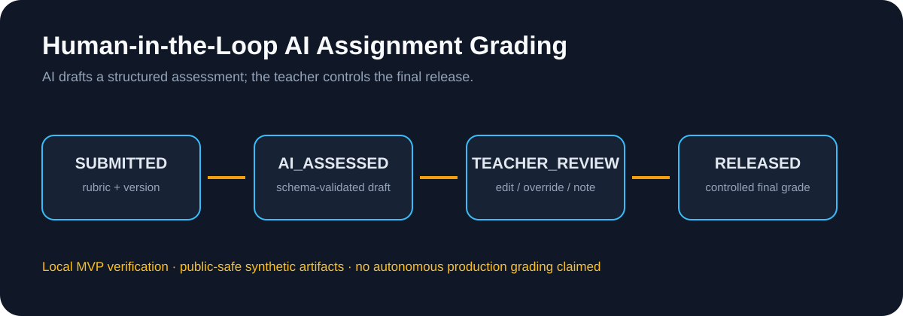
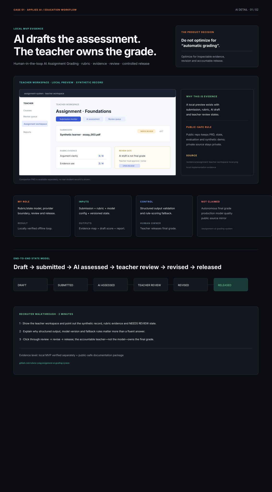

# Human-in-the-Loop AI Assignment Grading System

A public-safe portfolio package for an AI-assisted assessment workflow that combines rubric-based evaluation, teacher review, explainability, and controlled release gates.

**Status:** An offline runnable MVP and local AI bridge were verified in a separate private/local implementation; this public repository contains curated product, architecture, evaluation, and synthetic-demo materials. Formal production AI grading is not claimed.

**Role lens:** AI Product Management · Technical Product Prototyping · Workflow Systems · Applied AI

## Quick start and verification

1. Open the [detailed evidence preview](assets/evidence-overview.svg) to see submission, schema-validated assessment, teacher review and controlled release.
2. Follow the [portfolio evidence index](docs/portfolio-evidence-index.md).
3. Read the [architecture/state model](docs/architecture-and-state-model.md), [AI boundary](docs/ai-boundary.md), [evaluation plan](docs/evaluation-plan.md), and [limitations](docs/limitations.md).

**Public runtime:** The runnable offline MVP and local AI bridge were verified in a separate private/local implementation. This public repository intentionally contains curated product, evaluation and synthetic-demo material only.

**Test command:** `N/A — no public application test suite is claimed.` The private/local verification scope is documented; the public package is validated through the evidence index and release checklist.

**Evidence level:** `public-safe reconstruction` · `synthetic artifacts` · `private/local MVP verification`; not production-scale autonomous grading.

The teacher remains the final decision-maker; AI drafts are not equivalent to final grades.
## Case evidence: role / inputs / outputs / result / boundary

| | Portfolio proof |
|---|---|
| **My role** | Owned the assessment workflow, rubric/state model, structured AI contract, teacher review gate, release traceability and evaluation plan. |
| **Inputs** | Synthetic submission file, assignment/rubric, model/provider configuration and versioned workflow state. |
| **AI + system work** | AI drafts evidence and preliminary scoring; schema validation, rule fallback and workflow states keep the result inspectable. |
| **Outputs** | Evidence map, draft score, teacher revision queue, approved/rejected release state and exportable report. |
| **Result** | A locally verified offline MVP/review loop in the private implementation, with public-safe PRD, state model, demo script and evaluation materials here. |
| **Boundary** | Teacher owns the final grade; no production-scale quality, autonomous release or public student data is claimed. |

> This repository intentionally does not mirror the private implementation. It contains only public-safe materials and synthetic examples. No student data, real submissions, API keys, credentials, internal configuration, or employer-confidential content is included.

## Product signal

The product problem is not simply “call a large language model to grade an answer.” A credible assessment workflow must:

- let teachers define and validate a rubric;
- accept and track student submissions;
- produce a structured AI preliminary assessment;
- show evidence and reasoning that a teacher can review;
- allow teacher edits or overrides;
- preserve the difference between AI assessment and the final published grade;
- keep privacy, auditability, provider configuration, and release gates explicit.

## End-to-end workflow

    DRAFT
      ↓
    SUBMITTED
      ↓
    AI_ASSESSED
      ↓
    TEACHER_REVIEW
      ↓
    REVISED
      ↓
    RELEASED

The teacher remains the final decision-maker. An AI result is not equivalent to a final grade and cannot be published without the defined review step.

## What was verified locally

The private/offline MVP and local DeepSeek bridge were exercised through:

- student submission and version handling;
- course, assignment, roster, and rubric workflows;
- CSV and multi-file import;
- local persistence, workspace backup, and restore;
- structured AI preliminary assessment;
- teacher review and report export;
- local smoke, core-flow, syntax, and secret-scan checks.

These are local verification signals, not evidence of production scale, model quality, or external user outcomes. The formal production path remains gated until immutable model-version capture and production security controls are verified.

## Architecture signal

The system is organized around explicit domain objects:

    Course → Assignment → Rubric
    Student → Submission → AIAssessment → TeacherReview → FinalGrade

The AI provider is an adapter behind a controlled interface. Its output must pass schema validation before entering the review workflow. The production-minded boundary also calls for:

- prompt and model version capture;
- authenticated access and role separation;
- protected object storage for uploaded files;
- encrypted database connections and secrets management;
- retention and deletion rules;
- retry, failure, and observability paths;
- synthetic fixtures and repeatable evaluation.

## Public repository map

- [docs/product-brief.md](docs/product-brief.md) — users, problem, scope, and product decisions
- [docs/architecture-and-state-model.md](docs/architecture-and-state-model.md) — domain objects, lifecycle, and boundaries
- [docs/ai-boundary.md](docs/ai-boundary.md) — AI output, human review, and release gates
- [docs/evaluation-plan.md](docs/evaluation-plan.md) — metrics, golden cases, and local verification
- [docs/privacy-and-security.md](docs/privacy-and-security.md) — public-safe data and production controls
- [docs/demo-script.md](docs/demo-script.md) — a recruiter-friendly walkthrough
- [docs/limitations.md](docs/limitations.md) — what is implemented, proposed, and not claimed
- [docs/portfolio-evidence-index.md](docs/portfolio-evidence-index.md) — recruiter reading path and evidence status
- [docs/public-release-checklist.md](docs/public-release-checklist.md) — public commit release gate
- [docs/data-classification.md](docs/data-classification.md) — public/internal/restricted/never-public boundaries
- [docs/threat-model.md](docs/threat-model.md) — assessment workflow threats and controls
- [THIRD-PARTY-NOTICES.md](THIRD-PARTY-NOTICES.md) — educational content and dependency boundary

## Intended recruiter takeaway

This case demonstrates product judgment across AI workflow design, structured outputs, human-in-the-loop controls, privacy boundaries, provider abstraction, state modeling, and evaluation planning. It is an applied AI product case—not a claim of autonomous grading or a production education platform.

## Public-safe product decisions

The reviewed private baseline was distilled into a separate public-safe product artifact. It contains product decisions and review boundaries only; it does not mirror private implementation, real records, credentials, internal URLs, or source content.

- [Public-safe product decisions](docs/public-safe-product-decisions.md)
